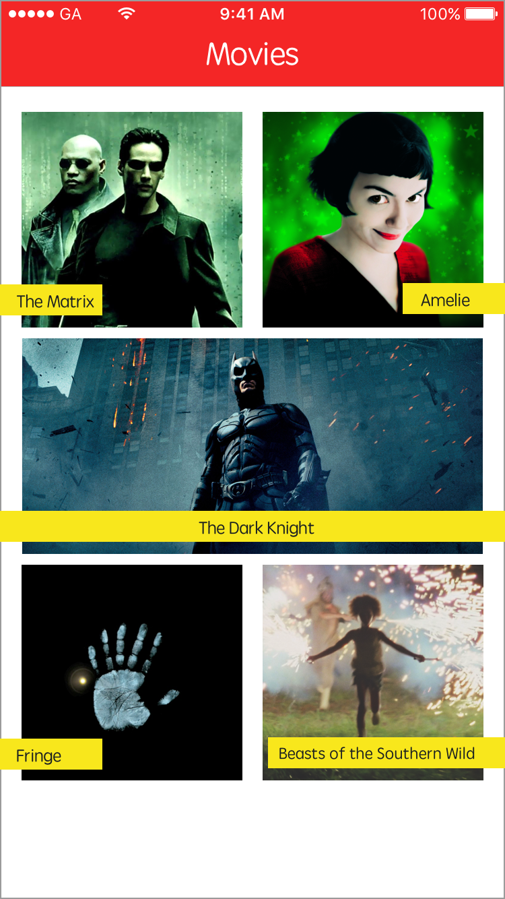
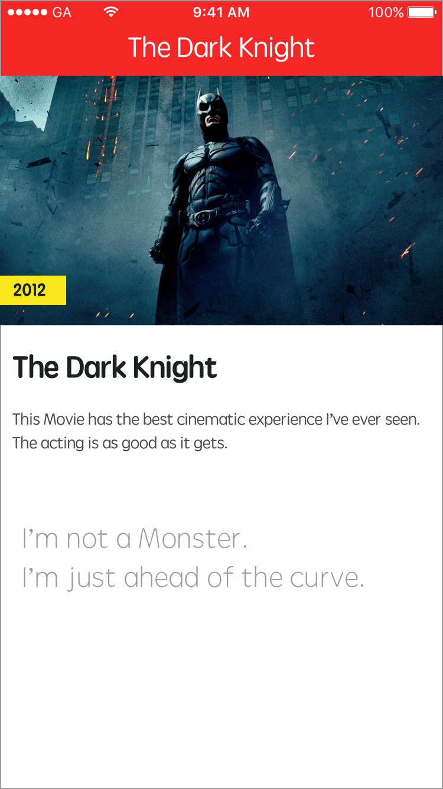
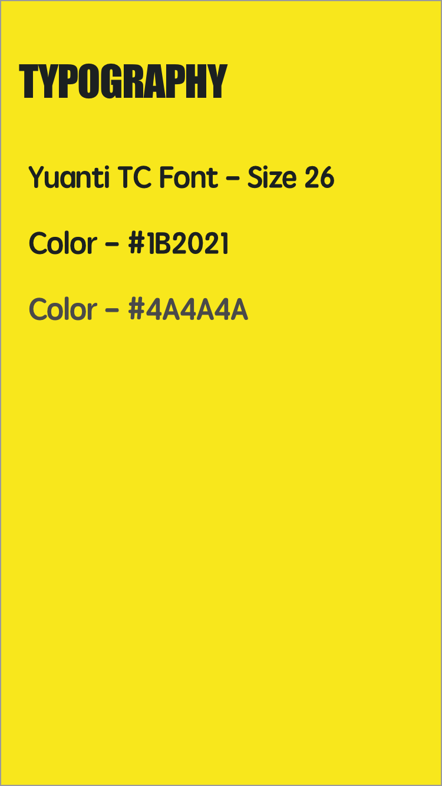

#  Segues Lab

## Introduction

> ***Note:*** _This can be a pair programming activity or done independently._

#### What we are doing

In this lab, we will create an App featuring your five favorite movies. You will practice using UIButtons, adding multiple View Controllers, and creating segues (transitions) between them.

#### Why we are doing it

Screen space is limited on mobile devices. In the same way that a book is split into pages, segues allow us to show the user a little bit of information at a time by breaking the app up into multiple View Controllers. Every app you work on will use segues!

## Exercise

### Requirements

Using the starter project provided:

+ Create the [Movie List](#Movie-List) screen using at least five movies.
+ Create a [Movie Info](#Movie-Info) screen for each movie using segues to connect them. Each screen should have:
 + A cover photo
 + The name
 + A description about why you like the movie
 + A description of your favorite scene or quote
+ Run the interface in the simulator and verify everything works and looks as expected.
+ Verify the following:
 - When you click on a movie's picture from the Movie List Screen, it should segue to the Movie Info Screen for that movie.
 - You should be able to navigate back-and-forth between the Movie List and the Movie Info Screens.

### Starter code

Using XCode, open the [project provided](starter-code) to get started.

## Solution Code

There is no solution code for this lab.

### Deliverables

The deliverables should look like this:

**Movie List**

    

**Movie Info**

    

### Bonus Activities

**Short**

+ Adhere to the [Style Guide](deliverables/Style-Guide.png)
> </img>

+ Run this on a real device

**Long**

+ Create a new View Controller that that comes after the Movie Info Screen showing the Movie's starring cast. For example, **Heath Ledger** and **Christopher Nolan**, star in **The Dark Knight**. Do this for each movie. Use a Profile Picture for each cast member, their name, and role in the movie.
+ Get creative and add more style!

# Additional Resources

+ [Official Apple Developer Website](https://developer.apple.com/library/ios/navigation/)
+ [Apple's Human Interface Guidelines](https://developer.apple.com/library/ios/documentation/UserExperience/Conceptual/MobileHIG/)
+ [XCode's Interface Builder](https://developer.apple.com/library/ios/recipes/xcode_help-interface_builder/Chapters/AboutInterfaceBuilder.html)
